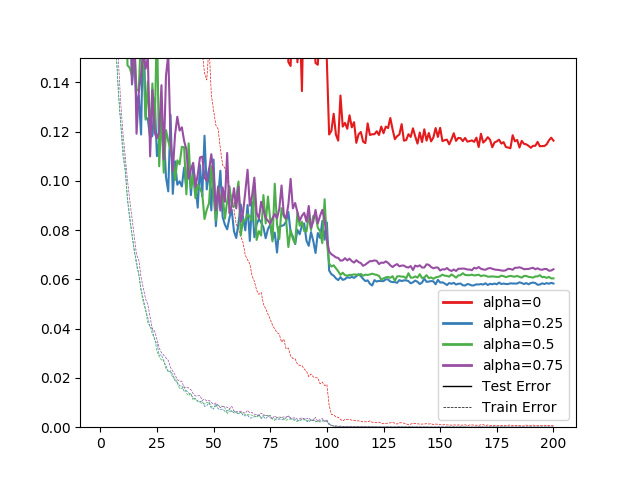

# OctConv-TFKeras
Unofficial implementation of Octave Convolutions (OctConv) in TensorFlow / Keras.

Y. Chen, H. Fang, B. Xu, Z. Yan, Y. Kalantidis, M. Rohrbach, S. Yan, J. Feng. *Drop an Octave: Reducing Spatial Redundancy in Convolutional Neural Networks with Octave Convolution*. (2019). https://arxiv.org/abs/1904.05049


# Usage
```python
from oct_conv2d import OctConv2D
# high, low = some tensors or inputs
high, low = OctConv2D(filters=ch, alpha=alpha)([high, low])
```

# CIFAR-10
Experimented with Wide ResNet (N = 4, k = 10). Train with colab TPUs.

| alpha | Test Accuracy |
|:-----:|:----------:|
|   0   |   88.68%   |
|  0.25 |   94.25%   |
|  0.5  |   94.06%   |
|  0.75 |   93.66%   |



# Prediction Time
CPU and GPU are colab environment. On CPU, use 256 samples for prediction, and on GPU, use 50000 samples for prediction. Both CPU and GPU are 32x32 resolution each.

## CPU
| alpha/s | Mean | Median | S.D. | Median/sample[ms] | Relative measured value  | Theoretical FLOPs cost |
|:----:|-------:|-------:|---------:|---------------------:|-----------:|------------------:|
|   0  |  39.18 |  38.96 |   0.6807 |               152.19 |        100 |               100 |
| 0.25 |  29.79 |  29.55 |   0.7705 |               115.43 |         76 |                67 |
|  0.5 |  20.61 |  20.46 |   0.5052 |                79.92 |         53 |                44 |
| 0.75 |  14.38 |  14.17 |   0.7874 |                55.35 |         36 |                30 |

Theoretical FLOPs cost are from the paper.

## GPU
| alpha/s | Mean | Median | S.D. | Median/sample[ms] | Relative measured value |
|:----:|-------:|-------:|---------:|---------------------:|-----------:|
|   0  |  60.43 |  59.94 |    1.693 |                 1.20 |        100 |
| 0.25 |  62.24 |  62.09 |   0.6996 |                 1.24 |        104 |
|  0.5 |  47.87 |  47.73 |   0.6224 |                 0.95 |         80 |
| 0.75 |  34.15 |     34 |   0.6747 |                 0.68 |         57 |

You can see that the time spent on prediction decreases with theoretical FLOPs costs, both CPU and GPU.

